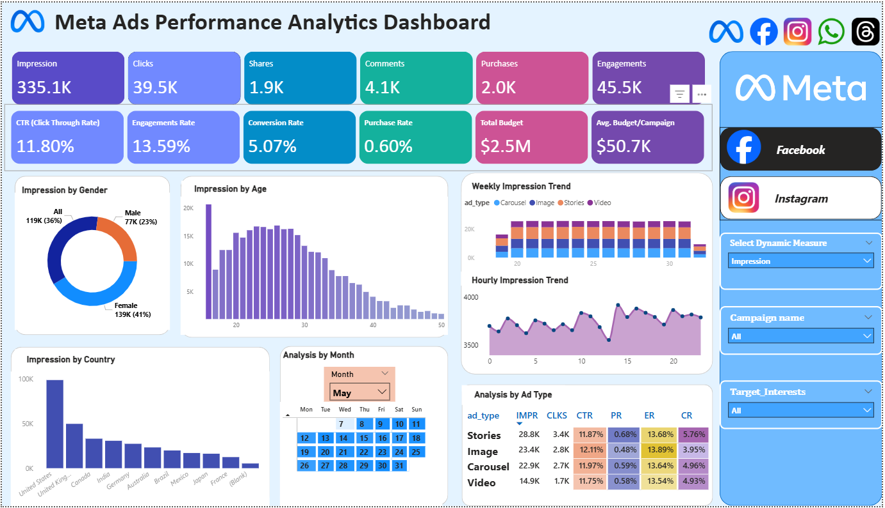

# 📊 Meta-Ads-Performance-Analytics-Dashboard-Power-BI-  

## 📌 Project Overview
The Meta Ads Performance Analytics Dashboard is an interactive Power BI dashboard designed to analyze and monitor advertising performance across Meta platforms such as Facebook and Instagram.

This dashboard provides insights into campaign performance, audience engagement, conversions, impressions, clicks, and budget utilization, helping marketers make data-driven decisions.

---

## 🎯 Objectives

- Monitor ad campaign performance in real time.
- Analyze impressions, clicks, engagements, and purchases.
- Track conversion and purchase rates.
- Compare performance across demographics and countries.
- Evaluate ad-type effectiveness.
- Optimize budget allocation and campaign strategy.

---

## 📈 Key Metrics

| Metric | Value |
|----------|----------|
| Impressions | 335.1K |
| Clicks | 39.5K |
| Shares | 1.9K |
| Comments | 4.1K |
| Purchases | 2.0K |
| Engagements | 45.5K |
| CTR | 11.80% |
| Engagement Rate | 13.59% |
| Conversion Rate | 5.07% |
| Purchase Rate | 0.60% |
| Total Budget | $2.5M |
| Avg. Budget/Campaign | $50.7K |

---

## 📊 Dashboard Features

### KPI Cards
- Impressions
- Clicks
- Shares
- Comments
- Purchases
- Engagements
- CTR
- Engagement Rate
- Conversion Rate
- Purchase Rate
- Total Budget
- Average Budget per Campaign

### Audience Analysis
- Impression by Gender
- Impression by Age Group

### Geographic Analysis
- Impression by Country

### Time-Based Analysis
- Weekly Impression Trend
- Hourly Impression Trend
- Monthly Analysis Calendar

### Campaign Performance
- Ad Type Comparison
- CTR Analysis
- Purchase Rate Analysis
- Engagement Rate Analysis
- Conversion Rate Analysis

---

## 🎛 Interactive Filters

The dashboard includes dynamic slicers for:

- Dynamic Measure Selection
- Campaign Name
- Target Interests
- Platform Analysis

These filters allow users to explore campaign performance from different perspectives.

---

## 🛠 Tools & Technologies

- Power BI Desktop
- Power Query
- DAX (Data Analysis Expressions)
- Data Modeling
- Interactive Visualizations

---

## 📷 Dashboard Preview

---

## 💡 Business Insights

- Identify high-performing ad types.
- Understand audience demographics.
- Track engagement trends over time.
- Measure conversion effectiveness.
- Optimize campaign spending.
- Improve ROI through data-driven decisions.

---

## 🚀 Future Enhancements

- Predictive Analytics
- Campaign ROI Forecasting
- Automated Alerts
- Advanced Audience Segmentation
- Real-Time Data Integration

---

## 👩‍💻 Author

**Pratibha Kamble**

Aspiring Data Analyst | Power BI Developer | SQL | Python | Data Visualization

### Connect with Me
- LinkedIn: www.linkedin.com/in/pratibhakamble29
- GitHub: https://github.com/pratibhakamble29

---
⭐ If you found this project useful, consider giving it a star!
